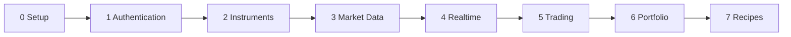

# Nubra Python SDK Guide

A step-by-step path through the SDK, from first login to live-ready trading tools. Every step links to runnable examples in [`examples/`](../../examples) and shows real output from the UAT sandbox.

## The path

| Step | Page | You will do | Examples |
| --- | --- | --- | --- |
| 0 | [Setup](00-setup.md) | Install, create `.env`, run a first example on UAT | [introduction](../../examples/introduction) |
| 1 | [Authentication](01-authentication.md) | Log in with OTP, `.env` or institutional credentials | [authentication](../../examples/authentication), [uat_environment](../../examples/uat_environment) |
| 2 | [Instruments](02-instruments.md) | Find the right stock, future or option contract | [get_instruments](../../examples/get_instruments) |
| 3 | [Market Data](03-market-data.md) | Prices, depth, option chains, history, fundamentals | [market_data](../../examples/market_data) |
| 4 | [Realtime Data](04-realtime.md) | Stream indices, option chains, depth, Greeks and candles | [realtime_data](../../examples/realtime_data) |
| 5 | [Trading](05-trading.md) | Place, modify, cancel orders and multi-leg strategies | [trading](../../examples/trading) |
| 6 | [Portfolio](06-portfolio.md) | Funds, holdings, positions and P&L | [portfolio](../../examples/portfolio) |
| 7 | [Recipes and Next Steps](07-recipes-and-next-steps.md) | Task lookup, worked workflows, going-live checklist | all of the above |

Start at step 0 and go in order, or jump to the page you need. Each page opens and closes with Previous and Next links.

Reference: [Glossary](glossary.md) (exact field and method names, allowed values) and [API rate limits](../../schemas/api_rate_limits.md).

## Jump to a task

| I want to... | Go to |
| --- | --- |
| Log in without typing an OTP every time | [1. Authentication](01-authentication.md) |
| Find a contract's ref_id, lot size or expiry | [2. Instruments](02-instruments.md) |
| Pull an option chain into pandas | [3. Market Data](03-market-data.md) |
| Watch a live ATM straddle | [4. Realtime Data](04-realtime.md) |
| Check margin, then place an order | [5. Trading](05-trading.md) |
| See my P&L in rupees | [6. Portfolio](06-portfolio.md) |
| Go live safely | [7. Recipes and Next Steps](07-recipes-and-next-steps.md) |

## Good to know

- **UAT first.** Every example defaults to the sandbox. Switching to live is a one-line change, covered in [Setup](00-setup.md) and the [going-live checklist](07-recipes-and-next-steps.md).
- **Prices are paise.** The API returns integers (116770 means Rs 1167.70). Examples print rupees and keep request payloads in paise.
- **SDK version.** Written and tested on `nubra-sdk` 0.5.4. See [VERSIONS.md](../../VERSIONS.md) and the [changelog](../../CHANGELOG.md).

[Back to the repository README](../../README.md)
